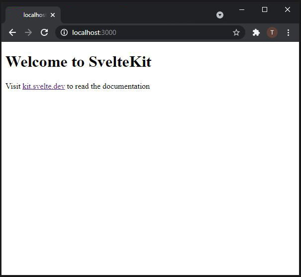

The purpose of this post is to show the basic workflow of svelte and introduce you to some svelte concepts like component and routing.

In this post we will create a svelte app that has a Home page, an About page, and a Contact page.

This post will assume you know how to start a svelte app.

If you are totally new to svelte, you can check out this post I made earlier on [starting a svelte app](/blog/starting-your-first-svelte-app).


## Svelte folder structure

Once you've gotten you app up and running in VS Code you should have a folder structure that looks something like the image below:


Your app is made up of files and folders which includes:

* node_modules - This folder houses all libraries and external modules. you will not have to do anything in this folder
* src -  This folder is where the bulk of your work will be done. This is the root of you app and all your code goes here. by default it contains:
	* routes - This folder handles the structure and routing of your app,
	* app.html - this is a skeletal html file in which the app will be rendered into,
	* global.d.ts - This is a Type script file. If you are not into TypeScript you can totally ignore this file.
* static - This folder holds all your static files like images, sounds, videos, fonts, etc.
* helper files - This are files that starts with a ".", eg. '.eslintrc.cjs'. This files contains settings and help manage your app extensions.
* jsconfig.json and svelte.config.js -  This JavaScript files contains the app configurations.
* package-lock.json and package.json -  This files contains reference to libraries and and modules that this app depends on.
* README.md -  This is a note written in markdown


## The App

As mentioned earlier, the bulk of the work will be done in the src folder which will be our focus.

Start the default app by running the below code in the `terminal`

```node
npm run dev
```

Open your browser and go to - ***localhost:3000***


There nothing much going on here, just a welcome page.

The code for this page can be found in `src/routes/index.svelte`
```html
<h1>Welcome to SvelteKit</h1>
<p>Visit <a href="https://kit.svelte.dev">kit.svelte.dev</a> to read the documentation</p>
```

## Svelte component
A Svelte component is any file with the `.svelte` extension just like our `index.svelte` file.
A Svelte component is made up of:
1. Any HTML code, 
1. A script tag -  This contains any javascript that controls the behavior of the component, and
1. A style tag - that defines the look and feel of the component, 

Our `index.svelte` file contains only HTML code;

This code can be modified to.
```html
<h1>This is the Home page</h1>
<p>My name is Theophilus and I am so excited to be creating my first Svelte app</p>
```

The good thing about Svelte is that the changes will be seen in the browser realtime.

let us enhance this component by adding javascript to it

```html
<script>
	let name = 'Theophilus';
</script>

<h1>This is the Home page</h1>
<p>My name is {name} and I am so excited to be creating my first Svelte app</p>
```

In the code above we simply defines a javascript variable 'name' and we used this variable within our HTML code.
So whenever we change the value of the 'name' variable the HTML reference changes too

```html
<script>
	let name = 'John';
</script>

<h1>This is the Home page</h1>
<p>My name is {name} and I am so excited to be creating my first Svelte app</p>
```

We can also style the component
```html
<script>
	let name = 'John';
</script>

<h1>This is the Home page</h1>
<p>My name is {name} and I am so excited to be creating my first Svelte app</p>

<style>
	h1{
		color: red
	}
</style>
```

We simply add a red color to the h1 element.

Cool right!!!


## Adding a component

Let us add an "about" component this will serve as the about page the about page.

In the `src/routes/` folder create a file and name it `about.svelte`.

Input the code below in the component

```html
<h1>This is the About page</h1>
<p>
	This app show the basic workflow of Svelte and serves as a testing ground for components and
	routing.
</p>
```

We can view this page by going to 'localhost:3000/about'  on the browser


How cool!!!!


Lets add a "contact" component the same way.
```html
<h1>This is the Contact page</h1>
<p>You can reach me on: theophilus.ogbolu@gamil.com</p>
```

Again, we can view this page by going to 'localhost:3000/contact'  on the browser

*smile*!!!

## The Layout Component

This is a special component that contains the common components that appears on all pages in the app. like a header, a nav and a footer.

Create a new fine in the `src/routes/` folder, the layout component is a special component and must be named `__layout.svelte`

This `__layout.svelte` file must contain a `<slot/>` tag. This is where the route pages will be rendered.

```html
<slot/>
```
we can now define our nav bar and footer in this component

```html
<nav>
	<a href="/">Home</a>
	<a href="/about">About</a>
	<a href="/contact">Contact</a>
</nav>

<slot/>

<footer>
	<p>Thank you for visiting my awesome app.</p>
</footer>
```

We have a nav element that contain links that navigates to index, about and contact components.

When any of the link is clicked the component is rendered in place of `<slot />`.


Let us now style our layout component and add some html element to define the structure of our app

```html
<nav>
	<div class="block">
		<a href="/">Home</a>
		<a href="/about">About</a>
		<a href="/contact">Contact</a>
	</div>
</nav>

<section>
	<div class="block">
		<slot />
	</div>
</section>

<footer>
	<div class="block">
		<p>Thank you for visiting my awesome app.</p>
	</div>
</footer>

<style>
	.block {
		max-width: 800px;

		margin: auto;
		padding: 20px 40px;
	}
	nav {
		background-color: bisque;
	}
	section {
		background-color: lightgrey;
	}
	section .block {
		background-color: white;
		min-height: calc(100vh - 210px);
	}

	footer {
		background-color: black;
		color: white;
	}
</style>

```

We now have a functional app that contains navigation, styles and a script.

This app can be expanded upon by following the simple process explained in this post.

You can get this project file from the [GitHub Repo](https://github.com/pheezie/basic-svelte-app)